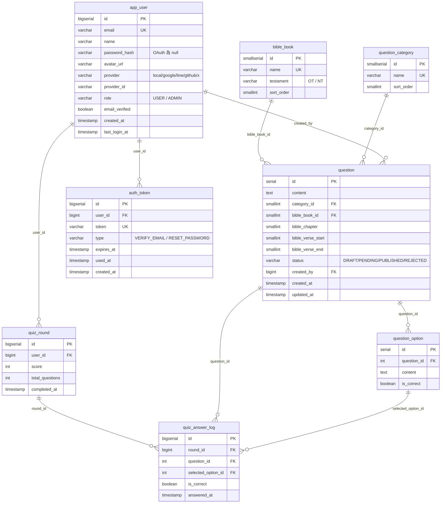

# BibleQuizJava

> 聖經問答遊戲 — Spring Boot 後端。隨機抽題、使用者作答、帳號系統、投稿審核、後台統計，一個寫到 production 的單體應用。

[](#)
[](#)
[](#)
[](#)
[](#)

線上 demo：<https://biblequiz.cc>　前端 repo：<https://github.com/Ancientshield/BibleQuizNuxt>

---

## 專案介紹

BibleQuizJava 是 [BibleQuiz](https://biblequiz.cc) 的後端服務，使用者可以進行 10 題隨機聖經問答測驗，作答後系統會記分、保留歷史、提供統計，並開放使用者投稿題目、管理者後台審核。

開發是一個人從 0 到 production 的學習過程，重點不在「功能多」，而在「每一層做對的事情」：把 Spring Boot 的分層架構、JPA 關聯、Spring Security、OAuth2、JWT、Docker 化、CI/CD、Cloudflare SSL 走完整整一輪。

---

## 技術棧

| 類別 | 選用 | 說明 |
| --- | --- | --- |
| 語言 / 框架 | Java 17、Spring Boot 3.5.9 | 單體應用，打包成 JAR 進 Docker |
| 持久層 | Spring Data JPA、Hibernate、HikariCP | Entity ↔ DB 自動映射，連線池 |
| 資料庫 | PostgreSQL 18 | 結構化欄位 + lookup table 正規化 |
| 認證 | Spring Security、JJWT 0.12、OAuth2 Client | Stateless JWT + 四家社群登入 |
| 寄信 | Spring Mail + Resend SMTP | 驗證信、密碼重設信 |
| API 文件 | springdoc-openapi 2.8 + Swagger UI | `/swagger-ui.html` 自動產生 |
| 部署 | Docker、Docker Compose、nginx、Cloudflare | VPS + 反向代理 + HTTPS |
| CI/CD | GitHub Actions | push → build image → push Docker Hub → VPS pull |

不用 Lombok 是刻意決定 —— Entity 手寫 getter/setter，讓原始碼自己說明它有哪些 public API，沒有藏在 annotation 後面的魔法。

---

## 設計理念

**一、分層隔離。** Controller 薄到只處理 HTTP（status code、JSON 序列化），Service 厚到放所有業務邏輯與交易控制，Repository 窄到只負責 SQL/JPQL，Entity 純粹只映射 DB。任何一層長出不屬於它職責的程式碼就要重構。

**二、無狀態優先。** 遊戲狀態 100% 在前端，後端只負責「發題」與「收結果」。`GET /api/biblequiz/start` 一次回 10 題含 `isCorrect`，前端本地驗答零延遲。原本逐題驗答的 `POST /check` 在 Phase E 被砍掉。

**三、DB 是地基。** Phase E 一次到位寫完 8 張表的 `schema.sql`，後續 Phase 不再 `DROP TABLE`。`category` 與 `bible_ref` 從 `VARCHAR` 改成 FK + 結構化欄位（`category_id`、`bible_book_id` + `chapter` + `verse_start` + `verse_end`），確保排序、查詢、下拉一致性。

**四、Constructor Injection 全面採用。** 全部依賴 `private final` + 單一建構子，沒有 `@Autowired` field injection。bean 依賴關係在建立當下就固定，符合 Spring 官方推薦。

**五、慣例大於設定。** Tomcat 自動啟動、Filter 自動註冊、Jackson 自動序列化、Hibernate 自動轉 SQL —— 框架做的事就讓框架做，自己只寫業務邏輯。

---

## 架構分層

```
HTTP 請求
    │
    ▼
┌──────────────────────────────────────────────────────────┐
│  Filter Chain                                            │
│    ├─ JwtAuthenticationFilter（讀 JWT → SecurityContext）│
│    └─ Spring Security Authorization（檢查角色 / 路徑）    │
├──────────────────────────────────────────────────────────┤
│  Controller（@RestController）                           │
│    接收請求 → 呼叫 Service → 回傳 JSON                    │
├──────────────────────────────────────────────────────────┤
│  Service（@Service, @Transactional）                     │
│    業務邏輯 / 權限檢查 / 後端重算 / DTO ↔ Entity 轉換     │
├──────────────────────────────────────────────────────────┤
│  Repository（extends JpaRepository）                     │
│    Derived Query / JPQL / JOIN FETCH / Specification     │
├──────────────────────────────────────────────────────────┤
│  Entity（@Entity）                                       │
│    Java 物件 ↔ DB 表的映射（Hibernate 執行）              │
├──────────────────────────────────────────────────────────┤
│  PostgreSQL                                              │
└──────────────────────────────────────────────────────────┘

  任何一層拋出例外 ──▶ @RestControllerAdvice（GlobalExceptionHandler）
                       └─▶ 統一 ErrorResponse JSON
```

每一層只跟相鄰的層溝通，不跳層。Controller 拿到的 Entity 由 Service 轉成 DTO，DB 結構不會洩漏到 HTTP 邊界；Repository 永遠不直接被 Controller 呼叫，所有交易邊界都在 Service 的 `@Transactional` 上劃定。

---

## 資料庫關聯圖

8 張表，分三組：題庫（左）、使用者（中）、作答紀錄（右）。



**為什麼這樣設計？**

`bible_book` / `question_category` 抽成 lookup table，是為了確保分類一致性 + 前端下拉選單。`bible_ref` 改成結構化欄位（書卷 FK + 章 + 起始節 + 結束節），讓題目可以按聖經順序排序、按書卷篩選，自由文字辦不到。`quiz_answer_log.is_correct` 冗餘儲存是查詢效能權衡 —— 算分時不用 JOIN 回 `question_option`。

`question.status` 用字串列舉（`DRAFT / PENDING / PUBLISHED / REJECTED`）配合 `created_by` FK 支撐投稿審核流程：使用者投稿預設 `PENDING`，每人未審核上限 10 筆；管理者後台用 `JpaSpecificationExecutor` 動態組合查詢條件（狀態 / 分類 / 書卷 / 投稿者 / 關鍵字），審核後改為 `PUBLISHED`。`auth_token` 走「一次性 token + `used_at` 標記」模式同時服務 Email 驗證與密碼重設，table 數量壓到最少。

---

## API 端點

### 遊戲 API（無狀態）

| 方法 | 路徑 | 權限 | 說明 |
| --- | --- | --- | --- |
| GET | `/api/biblequiz/start` | 公開 | 隨機取 10 題，包含選項與 `isCorrect`，前端本地驗答 |
| POST | `/api/user/quiz/submit` | 登入 | 提交作答結果，後端重算分數後寫入 `quiz_round` |
| GET | `/api/user/history` | 登入 | 取得歷史回合列表 |
| GET | `/api/user/stats` | 登入 | 取得個人統計（總題數、正確率、最佳分數） |

### 認證 API

| 方法 | 路徑 | 權限 | 說明 |
| --- | --- | --- | --- |
| POST | `/api/auth/register` | 公開 | Email 註冊（送驗證信，不發 JWT） |
| GET | `/api/auth/verify` | 公開 | 驗證 Email |
| POST | `/api/auth/resend-verification` | 公開 | 重寄驗證信（60 秒冷卻） |
| POST | `/api/auth/login` | 公開 | Email 登入（需已驗證），回 JWT |
| POST | `/api/auth/forgot-password` | 公開 | 寄密碼重設信 |
| POST | `/api/auth/reset-password` | 公開 | 帶 token 重設密碼 |
| GET | `/api/auth/profile` | 登入 | 取得當前使用者 |
| GET | `/oauth2/authorization/{provider}` | 公開 | OAuth 入口（google / line / github / x） |

### 題目投稿與管理

| 方法 | 路徑 | 權限 | 說明 |
| --- | --- | --- | --- |
| POST | `/api/questions` | 登入 | 投稿題目（status = PENDING，每人 ≤ 10 題） |
| PUT | `/api/questions/{id}` | 投稿者 | 編輯自己的投稿（限 PENDING / REJECTED） |
| DELETE | `/api/questions/{id}` | 投稿者 | 刪除自己的投稿 |
| GET | `/api/admin/questions` | ADMIN | 後台題目列表（支援多條件動態查詢） |
| POST | `/api/admin/questions/{id}/publish` | ADMIN | 審核通過 |
| POST | `/api/admin/questions/{id}/reject` | ADMIN | 審核退回 |
| `*` | `/api/admin/categories` | ADMIN | 分類 CRUD |

API 文件自動產生於 `/swagger-ui.html`。

---

## 第三方整合

| 服務 | 用途 | 關鍵實作 |
| --- | --- | --- |
| **Google OAuth 2.0** | 社群登入 | `spring-boot-starter-oauth2-client` 內建 provider，PKCE |
| **LINE Login** | 社群登入 | 手動設定 OIDC endpoints，回傳的 `id_token` 含 email |
| **GitHub OAuth** | 社群登入 | 預設 scope 沒有 email，需手動呼叫 `/user/emails` |
| **X (Twitter)** | 社群登入 | OAuth 2.0 + PKCE，X API v2 沒回 email |
| **Resend** | SMTP 寄信 | 取代 Gmail SMTP，避免被當垃圾信 |
| **Cloudflare** | DNS + SSL + Email Routing | `biblequiz.cc` 全套，含 catch-all 信箱 |
| **Docker Hub** | image registry | CI/CD push image，VPS pull 部署 |

四家 OAuth 共用同一個 `OAuth2SuccessHandler`：登入成功 → 取出 email / name / avatar → 找 `app_user` 或自動建立 → 簽 JWT → redirect 到前端 `/oauth/callback?token=...`。token 走 URL 是 SSG 前端的權衡決定，沒有 SSR session 可掛。

四家差異處理各有眉角：LINE 必須宣告 `openid email profile` 三個 scope 才會回 email；GitHub 預設不給 email，要在 handler 內額外打 `GET /user/emails`；X 走 OAuth 2.0 + PKCE，且 API v2 完全不回 email，只能用 `id` 當 unique key 並用 username 兜出顯示名。Spring Security 反向代理場景要設定 `server.forward-headers-strategy=framework`，否則 `redirect_uri` 會帶內網 IP 跑去登入。

---

## 套件結構

```
com.biblequiz.app/
├── BibleQuizApplication.java       啟動入口（@SpringBootApplication）
├── HelloController.java            煙霧測試 GET /hello
├── config/
│   └── SecurityConfig.java         Spring Security + OAuth2 + PasswordEncoder
├── controller/                     7 個 @RestController
│   ├── BibleQuizController         遊戲 API
│   ├── AuthController              註冊 / 登入 / 驗證 / 重設密碼
│   ├── QuestionController          投稿 CRUD
│   ├── UserQuizController          作答提交
│   ├── UserHistoryController       歷史與統計
│   ├── AdminQuestionController     後台題目管理
│   └── AdminCategoryController     後台分類管理
├── service/                        8 個 @Service
│   └── ...                         業務邏輯、交易、權限檢查
├── repository/                     8 個 Repository + Specification
│   └── QuestionSpecification.java  動態查詢（Criteria API）
├── entity/                         10 個 @Entity + 4 個 enum
│   └── ...                         Question / Option / Category / BibleBook
│                                   AppUser / AuthToken / QuizRound / AnswerLog
├── dto/                            17 個 DTO（請求 / 回應 / 錯誤）
├── security/
│   ├── JwtTokenProvider            簽 / 驗證 JWT
│   ├── JwtAuthenticationFilter     每個請求取 JWT 進 SecurityContext
│   └── OAuth2SuccessHandler        四家 OAuth 共用 handler
└── exception/
    └── GlobalExceptionHandler      @RestControllerAdvice 全域例外處理
```

按職責分套件（Controller / Service / Repository 各自一包），不按功能。專案規模 < 100 類別前這種結構最直觀。

---

## 在本機跑起來

需要 Java 17 + 本機 PostgreSQL。

```bash
# 建立資料庫並匯入 schema 與種子資料
psql -U postgres -d postgres -f ../vps/db/schema.sql
psql -U postgres -d postgres -f ../vps/db/data-v2.sql

# 設定 application-dev.properties（不入版控）
cp src/main/resources/application-dev.properties.example src/main/resources/application-dev.properties
# 編輯 DB 帳密、JWT secret、OAuth client id/secret、SMTP 帳號

# 啟動
chmod +x mvnw
./mvnw spring-boot:run
```

後端跑在 `http://localhost:8080`，Swagger UI 在 `http://localhost:8080/swagger-ui.html`。

### Docker 方式

```bash
# 從父專案目錄
cd ..
docker compose up -d
```

`docker-compose.yml` 一次起 PostgreSQL + Backend，env 從 `.env` 注入。VPS 用 `vps/docker-compose.yml`（`image:` 直接拉 Docker Hub）。

---

## 開發進度

| Phase | 主題 | 狀態 |
| --- | --- | --- |
| 0 | 基礎 API（Entity / Repo / Service / Controller） | 完成 |
| A | Docker 化 + VPS 部署 + CI/CD | 完成 |
| B–C | Nuxt 前端 + 上線 | 完成 |
| D | Cloudflare domain + SSL | 完成 |
| E | DB 正規化 + 前端本地驗答 | 完成 |
| F | Spring Security + JWT + Email + 四家 OAuth | 完成 |
| G | 投稿 / 審核 / 作答紀錄 / 統計 | 完成 |
| H | v2 部署升級、效能優化 | 進行中 |

---

## License

MIT
